# Class Notes Live

Live, exam-ready notes for five MBA Marketing courses, written automatically from classroom recordings.

A wearable recorder (NeoSapien) captures every lecture. Whenever I open my laptop, a sync job pulls new recordings, keeps only real lectures from my five courses using the class timetable, has Claude write structured exam notes, and publishes them to a website my classmates can open on any device.

**Live site:** https://YOUR-USERNAME.github.io/class-notes-live/

## What it does

- **Course-aware filtering.** A recording goes live only if it was made inside that course's timetable slot and has no social or personal content. Off-topic lines inside lecture minutes are stripped in code before any AI sees them.
- **Exam notes, not transcripts.** Each class day becomes an overview, a key terms table, definitions with class and real business examples, exam tips, and practice questions.
- **Revision tools.** Practice questions become flip flashcards and a quick quiz.
- **Announcements.** CIA and submission deadlines show in green with live countdowns, and turn grey once the date passes.
- **Privacy by design.** Raw recordings and minutes never leave my laptop. Only the finished notes are published.

## How it works

```mermaid
flowchart LR
  A[NeoSapien recorder] -->|Claude Code + NeoSapien connector| B[fetch: data/private/inbox]
  B --> C[classify.js: timetable + filters]
  C -->|class days needing notes| D[Claude Code: write exam notes]
  D --> E[data/notes/*.md]
  E --> F[build.js: docs/data.json]
  F -->|git push| G[GitHub Pages site]
  G -->|checks every 2 min| H[Classmates' browsers]
```



| Step | File | What it does |
| --- | --- | --- |
| 1 | `sync/prompts/fetch.md` | Claude Code calls the NeoSapien connector and saves new recordings locally |
| 2 | `sync/classify.js` | Matches each recording to a timetable slot, drops social content, cleans minutes, lists class days needing notes |
| 3 | `sync/prompts/notes.md` | Claude Code writes exam notes in a fixed structure and writing style |
| 4 | `sync/mark-done.js` | Records what each note covers so it is not rewritten |
| 5 | `sync/build.js` | Bundles public notes, announcements and timetable into `docs/data.json` |
| 6 | `sync/sync.sh` | Runs steps 1 to 5 and pushes to GitHub when something changed |
| 7 | `sync/install-autosync.sh` | Schedules the sync to run on wake and every 15 minutes while awake |

## Project structure

```
docs/            Website (GitHub Pages): index.html + data.json
data/notes/      Published exam notes, one Markdown file per course and class day
data/            timetable.json, allowlist.json, announcements.json
data/private/    Raw recordings and minutes (git-ignored, never published)
sync/            Pipeline scripts and Claude prompts
```

## Tech

Node.js (no dependencies), Claude Code in headless mode, the NeoSapien MCP connector, GitHub Pages, macOS launchd.

## Run it yourself

See [SETUP.md](SETUP.md). For the product thinking behind it, see [CASE_STUDY.md](CASE_STUDY.md).
